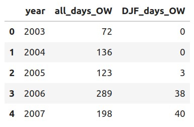

# Open Water Index

### Introduction

These datasets each represent an annually-resolved index of open water persistence around the Flade Isblink and Austfonna ice caps. They draw on data from the [OSISAF Global Sea Ice Concentration Climate Data Record](http://dx.doi.org/10.15770/EUM_SAF_OSI_0008), and reflect the number of days per year for which open water is prevalent beyond a given fractional threshold in a circular region of given radius.

### Defining a Radius and Open Water Threshold

The central points of the analysis are the summits of the icecaps. I defined these based on the given coordinates of ice-cores drilled at the summits ([Isaksson et al., 2005](https://journals.sagepub.com/doi/pdf/10.1191/0959683605hl820rp); [Lemark, 2010](https://nbi.ku.dk/english/theses/masters-theses/andreas-lemark/A_Lemark_Speciale.pdf)). I then identified all grid cells of the sea ice concentration product that fall within a given radius; the values of sea ice concentration in grid cells falls between 0 and 1. On each day of the year I sum the values of the cells. I then normalise them by finding the maximum value in the 2003 - 2023 timeseries, and dividing each daily value by the maximum. This produces a daily timeseries of the ice cover, as a fractional value of the maximum possible ice cover. The open water fraction (FOW) is then produced by subtracting the ice-cover value from 1. Nine radius values are considered, from 100 km to 900 km. 

In order to identify years with extremely long or short open-water periods, we calculate the number of days per year that FOW (which varies between 0 & 1) is below a certain threshold. This number can be denoted NOW, and is a function of the radius and the threshold value. Each dataset contains annual timeseries for NOW calculated for all values of radius (100 -> 900 km) and thresholds between 10% and 90%. 

Figure 1: Left hand panel shows the timeseries of fractional open water (FOW) for four consecutive years (2009 - 2012). Shaded area illustrates FOW values above the 70% threshold value; days for which the FOW timeseries exceeds the threshold contribute to the NOW value for the year, shown in the right hand panel. 

Figure 2: Illustration of interannual variability in extremes in NOW values for different FOW thresholds (30 & 70% on top row) and radii (200 and 800 km on bottom row). . 

### Winter Open Water

For every NOW timeseries, an additional one is presented just for the consecutive winter months of December, January and February. In this case, year numbers refer to the year in which the January and February occur: for instance, 2009 winter NOW values reflect the number of open water days in December of 2008 and the January + February period of 2009. Leap years are accounted for.

### Reading The Files

Data are stored in Hierarchical Data Format (.h5) files. In each file (corresponding to a site). Keys represent different combinations of radius thresholds and percentage open water thresholds. So the key “rad_thresh_300_40pc” represents a timeseries of days of open water defined with a 300 km radius and an open-water threshold of 40 percent. This will produce a dataframe like the one below.

### How It’s Made

Data are produced in a two-step process, the first running on the UiT RCM3 Server. To do this, ice_cover_make_pickles.py produces a number of intermediate pickle files in subdirectories. These are binary and can be used in more detailed methodological analysis. The ice_cover_process_pickles.py routines then gathers up the pickles and produces analysis-ready index in hdf5 format. 

There’s also some code to illustrate what’s going on in [ice_around_island.ipynb](https://github.com/robbiemallett/open_water_index/blob/main/ice_around_island.ipynb). The figures above were made with [analyse_h5.ipynb](https://github.com/robbiemallett/open_water_index/blob/main/analyse_h5.ipynb) and [fow_construction.ipynb](https://github.com/robbiemallett/open_water_index/blob/main/fow_construction.ipynb).
